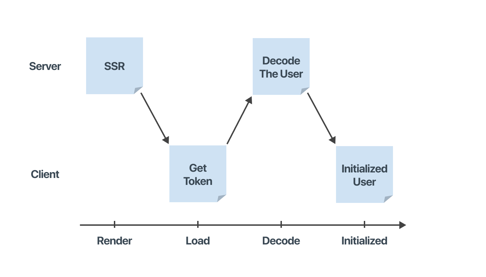

# Authentication

The authentication system is extendable and flexible. It's also designed for simplicity and scalability.

## Understanding Authentication

Factor's auth system is powered by [tokens](https://jwt.io/) which are sent to the server each time a user makes a request.

For Factor to be highly scalable, there is no user-specific content rendered server-side. This has important implications in terms of how the system is designed and how you'll work with it.

### Lifecycle

When a logged-in user loads a page, the following occurs:



1. **Server Render:** The server renders the page with no user-specific content.
2. **Client Load:** On client load, Factor checks `localStorage` for a token indicating a logged-in user
3. **Server Decode:** If a token is found, it's sent to an endpoint which decodes it and returns the user associated with it
4. **Client Initialized:** In the client, the returned user is stored as the `currentUser` and the user is considered initialized.

> **Bearer:** For each endpoint request, the token is passed along and decoded into a `bearer` user which is used for permissions and security on a query by query basis.

This system has advantages:

- **Low overhead.** No sessions or other server side considerations.
- **Scalable.** All pages can be fully cached on server.
- **Simple.**

## Authenticating a User

To login or signup a user from the client, Factor provides you with the utility function `authenticate`. Use it as follows:

```js
import { authenticate } from "@factor/api"

// userCredential is user information + token
const userCredential = authenticate({ email, displayName, newAccount: true, password })
```

If authentication is successful, it will store the returned token locally and the user will be considered logged in.

## Get User State

You can get the current user's state anytime within Factor with one caveat: you need to wait for initialization. Before user initialization, they are always considered logged out.

So to check the user's state, all you need is `userInitialized()` and `currentUser()`.

```js
import { userInitialized, currentUser, isLoggedIn, stored } from "@factor/api"

const getUser = async () => {
  let user

  // User hasn't initialized
  user = currentUser() // undefined

  isLoggedIn() // false

  // Wait for initialization (returns user)
  user = await userInitialized() // user

  // After initialization, currentUser is set
  user = currentUser() // user

  isLoggedIn() // true

  stored("currentUser") // user
}
```

## Users in Components

Working with users in Vue components is slightly tricky because the rendered source and the initial mounted source in the client must match exactly. They call mismatches "hydration errors" and they can be difficult to debug.

However, using the trick above it can be straight forward. Just make sure to apply all user-based changes in the mounted Vue lifecycle hook (which only runs in the client, not the server).

```js
// vue component
import { userInitialized } from "@factor/api"
export default {
  data() {
    return {
      user: false,
    }
  },
  async mounted() {
    this.user = await userInitialized()
  },
}
```

## Authentication and Routes

When users are loading pages or navigating, there are cases when you want to make sure they are logged in. To trigger sign-in on specific routes, you need to add a route meta property with `auth = true` you can also require privileges with `accessLevel`.

```js
addContentRoute({
  path: "/protected",
  component: () => import("./some-component"),
  meta: {
    auth: true, // require logged in
    accessLevel: 100, // user must have access of 100+
  },
})
```
