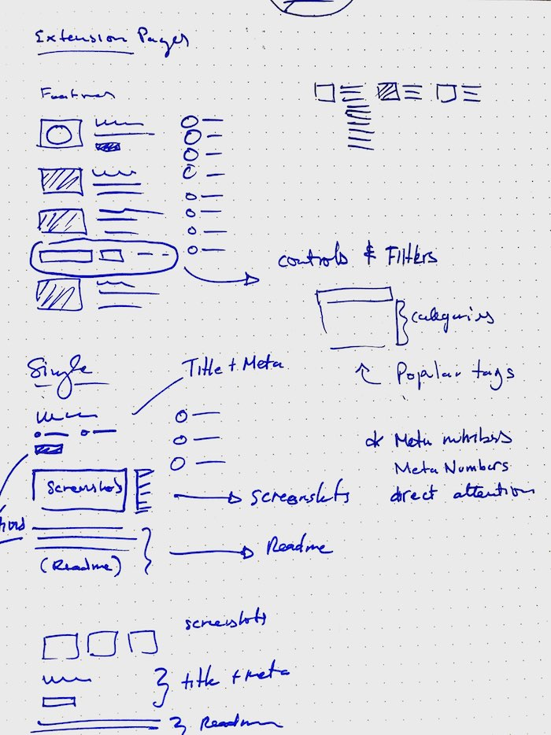
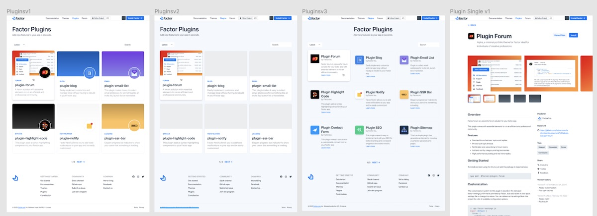

# Before You Code

As a best practice, we recommend some planning before you get started with your application. Here are some tips on how we do it.

## A Basic Spec

The first step in any successful project is to outline what the project is going to do. Most people have this "in mind" but writing it down creates a much more concrete planning and conceptualizing. Jeff Spolsky, a great technical writer and entrepreneur, has [written some articles](https://www.joelonsoftware.com/2000/10/02/painless-functional-specifications-part-1-why-bother/) on why specs are important.

The good news is that, in our case, you can often get by with just a bulleted list.

```yaml
- The Website Should have:
    - Forum: A community hub
    - Accounts: Needed so users can manage their membership
    - Blog: Updates
    - Homepage: Explains what we do
```

## Think On Paper

The next step is to sketch out in 2d what you'd like your app to look like and do. We call this "thinking on paper," and it's generally the most important part of creating a superior result.

Sketching things out on paper has a way of removing all technical noise and allowing you to focus on only the essence of what you're trying to do.



## WireFrame and Design

Now that you've got some ideas conceptualized on paper, we then take things to a wireframing or design program. These days we generally use [Figma](https://www.figma.com/) for this.

This step is not meant to help you get to the final design, necessarily, but it can give you a clue as to which visual elements work and don't work.



## Research

The next step after design is to do some research on best practices. If you are using Factor, we have worked through most common use cases and are happy to help you figure out how to get the desired result.
