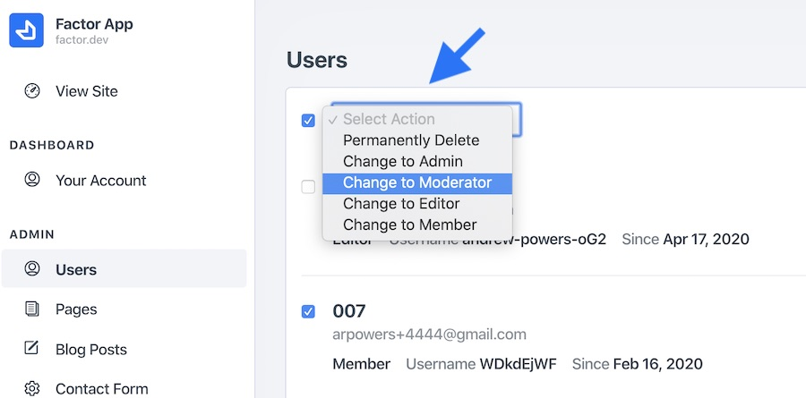

# Users and Roles

One of the defining features of a quality app is your user and authentication system. Factor includes a powerful yet simple implementation that can handle almost anything you might need.

## Setting Up

Setting up authentication only requires two things: a database and a password (token) for encoding and decoding authentication data. You'll also want SMTP working for email verification.

In your `.env` make sure you've set up the following:

```bash
FACTOR_DB_CONNECTION=mongodb+srv://...
FACTOR_AUTH_SECRET=random-secret-password
SMTP_USERNAME=postmaster@email.example.com
SMTP_PASSWORD=--PASSWORD--
SMTP_HOST=smtp.email-provider.org
```

## Initial Admins Users

Factor has a simple user role system that is designed to serve most privilege based scenarios. To get this system started you first need to create some "admin" users that can then promote other users from the dashboard.

To add these initial admin users, you can add a list of emails in your `package.json` under `admins`:

```json
{
  // package.json stuff
  "factor": {
    // factor stuff
    "admins": ["youremail@example.com", "anotheremail@example.com"]
  }
}
```

or if you like in your `.env` file under `FACTOR_ADMINS`.

```bash
# .env
FACTOR_ADMINS="youremail@example.com,anotheremail@example.com"
```

Now once a user with that email is logged in and verified, they will have access to admin features in the Factor dashboard.

## Logging In and Signing Up

If you'd like to trigger signup/login and logout from within you're app, Factor provides you two useful functions:

```js
import { showSignIn, logout } from "@factor/api"

// Shows signin UI (default or from plugin)
showSignIn()

// Logs the user out (if signed in)
logout()
```

## Email Verification

Email verification is important because you need to make sure a user owns the email they sign up with.

When a user signs up, Factor sends them a verification email with a link to click to verify their account. For this to work, you'll need to have SMTP email setup (or verification emails won't be sent).

## User Roles

Inside Factor there is a concept of user roles assigned to users. Each role is assigned an access level (0 - 500) and given privileges related to the scope of that role:

- **Admin (500)** - All privileges
- **Moderator (300)** - Ability to manage and edit posts, users
- **Editor (200)** - Can write and edit their own posts and others
- **Creator (100)** - Can write and edit their own posts
- **Member (1)** - Logged in, can manage own account settings
- **Anonymous (0)**

### Promoting Users to Roles

If you are an admin user, then you will have the right to "promote" other users in the CMS directly from the dashboard. You can find this functionality under `dashboard > users > select action`.



## Advanced Authentication and Privileges

To learn more about working with authentication and privileges [check out the doc](./authentication).
